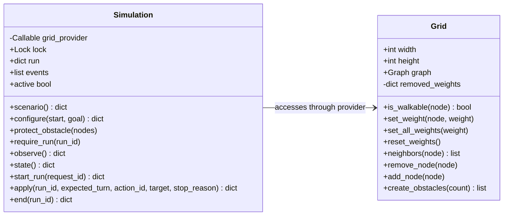
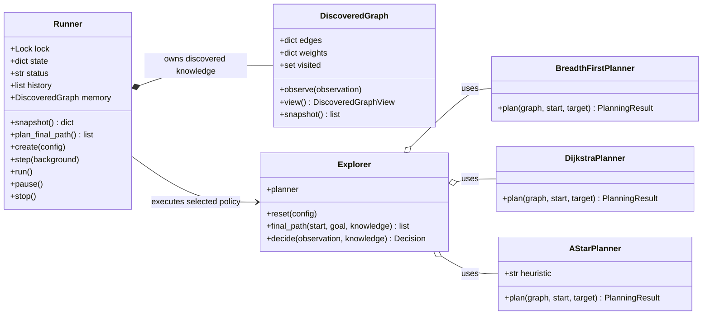

# Class diagrams

These diagrams show the functional classes in the environment and agent. Data
transfer models, exceptions, protocols, and gRPC-generated classes are omitted.

## Environment

`Grid` owns the mutable NetworkX map. `Simulation` accesses the current grid
through a provider so replacing or resizing the grid does not require replacing
the simulation instance.

## Agent

`Runner` controls execution and records each turn. It updates
`DiscoveredGraph` from local observations, while `Explorer` selects a target and
delegates route calculation to the planner configured for the run.
